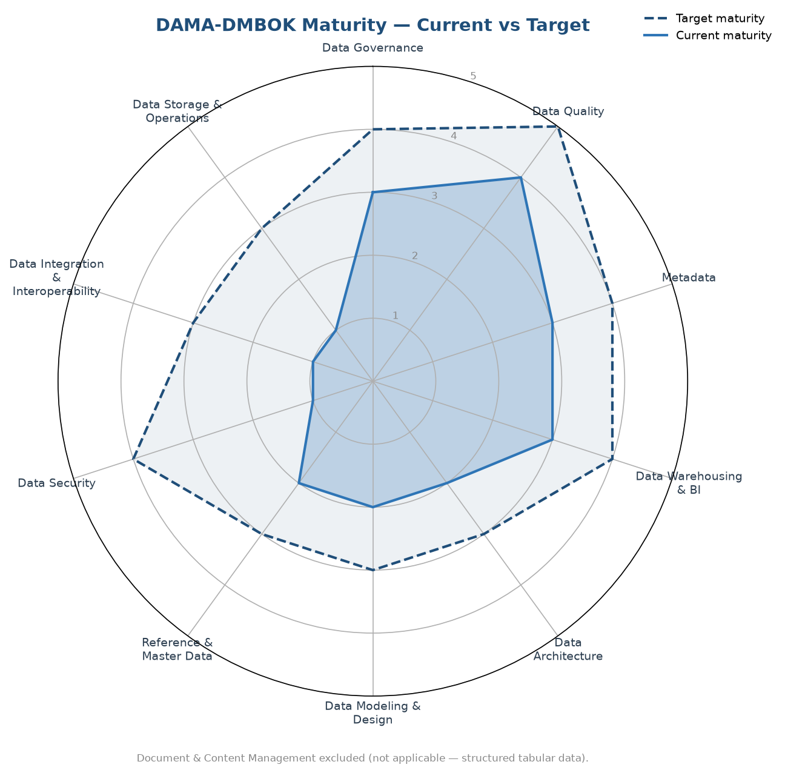

# Governance — DAMA-DMBOK Alignment

This folder aligns the project to the **DAMA-DMBOK2** data management framework and tracks the project's maturity against it. The assessment itself lives in [`dama_alignment.csv`](dama_alignment.csv); this page explains what it means and how to read it.

## What is DAMA-DMBOK?

DAMA International's **Data Management Body of Knowledge** (DMBOK2, 2017) is a widely used industry framework that organizes data management into **11 knowledge areas** arranged around a central **Data Governance** hub — the "DAMA wheel." Governance sits at the center because it underpins every other area, from data quality to security to integration.

## Why align this project to DAMA

- It replaces an ad-hoc collection of scripts and CSVs with a recognized, structured framework.
- It provides a shared vocabulary that survives changes in tools and vendors.
- It makes the project's strengths and gaps **explicit, measurable, and defensible**.
- It is the language enterprise data governance teams actually use day to day.

## Maturity scale (1–5)

Each knowledge area is scored on a CMMI(Capability Maturity Model Integration)-style scale:

| Level | Label | Meaning |
|-------|-------|---------|
| 1 | Initial / Absent | Ad hoc or nonexistent |
| 2 | Emerging | Some artifacts exist, inconsistent |
| 3 | Defined | Documented and standardized |
| 4 | Managed | Measured and enforced |
| 5 | Optimized | Automated and continuously improved |

## How to read the assessment

`dama_alignment.csv` scores all 11 knowledge areas. Its columns:

- **Current_Maturity / Target_Maturity** — where the area stands today, and where it is heading.
- **Current_Label** — the scale label for the current score.
- **Evidence** — the files in this repo that support the score.
- **Gap** — what is missing to reach the target.
- **Improvement_Initiative** — the concrete work that closes the gap.

## Snapshot: strengths and gaps

- **Strong (Defined–Managed):** Data Quality (4), and Metadata, Data Governance, and Data Warehousing & BI (3) — the analyst-facing core of the project.
- **Emerging (2):** Data Architecture, Data Modeling & Design, and Reference & Master Data.
- **Early stage (Initial, 1):** Data Security, Data Integration & Interoperability, and Data Storage & Operations — the areas the roadmap below targets.
- **Not applicable:** Document & Content Management (this is a structured, tabular dataset).

## Improvement roadmap

The improvement initiatives group into three sequenced workstreams:

1. **Workstream 1 — Data Security.** Role-based access control, data masking driven by sensitivity classification, and access auditing. Raises Data Security from 1 toward 4.
2. **Workstream 2 — Scalability & Integration.** Multi-source ingestion, storage layering and lifecycle operations, a warehouse/serving layer, a target-state architecture and data model, formalized reference data, and DQ trend monitoring. Raises Integration, Storage, Architecture, Modeling, Reference & Master Data, Metadata, and BI toward their targets.
3. **Workstream 3 — AI Governance.** A governance policy framework and an AI governance layer aligned to the EU AI Act (Article 10 data governance for high-risk systems). Raises Data Governance from 3 toward 4.

## References

- [DAMA-DMBOK Framework — DAMA International](https://www.damadmbok.org/copy-of-about-dama-dmbok)
- [DAMA-DMBOK explained — Snowflake](https://www.snowflake.com/en/data-governance/frameworks/dama-dmbok/)
